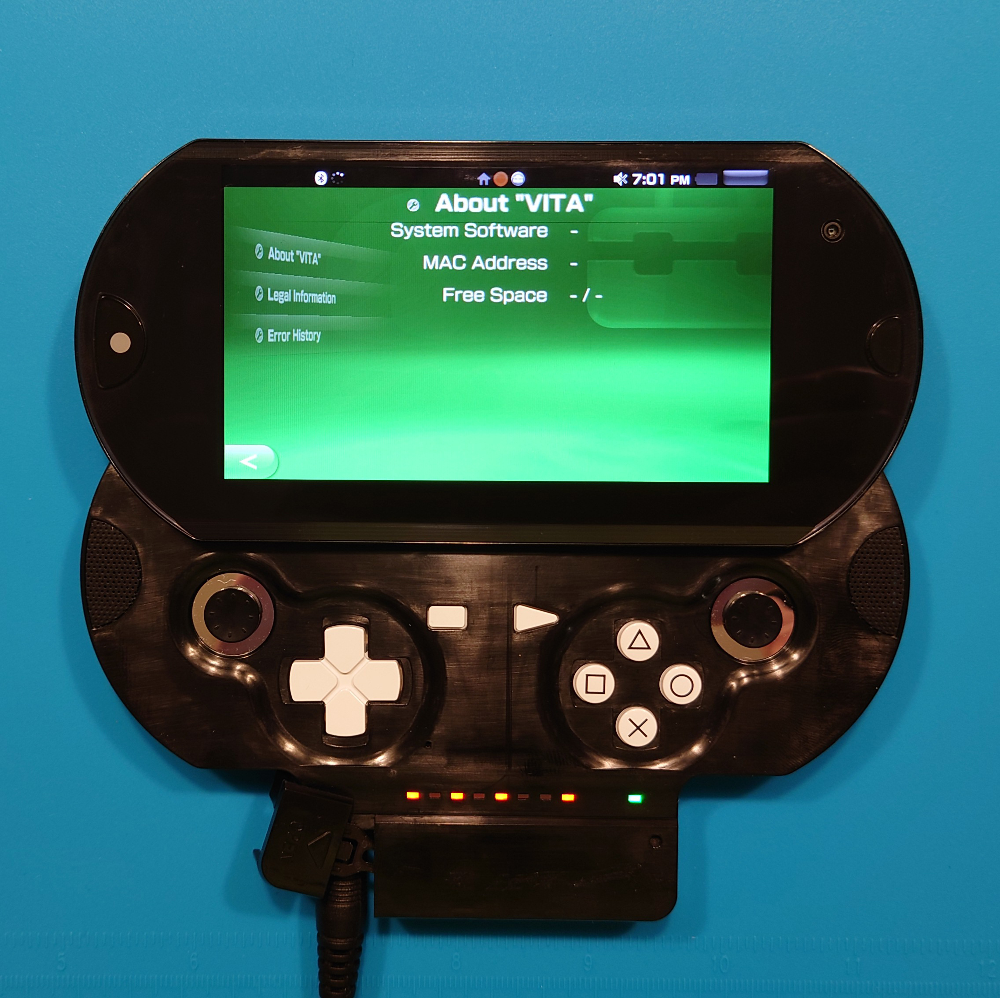
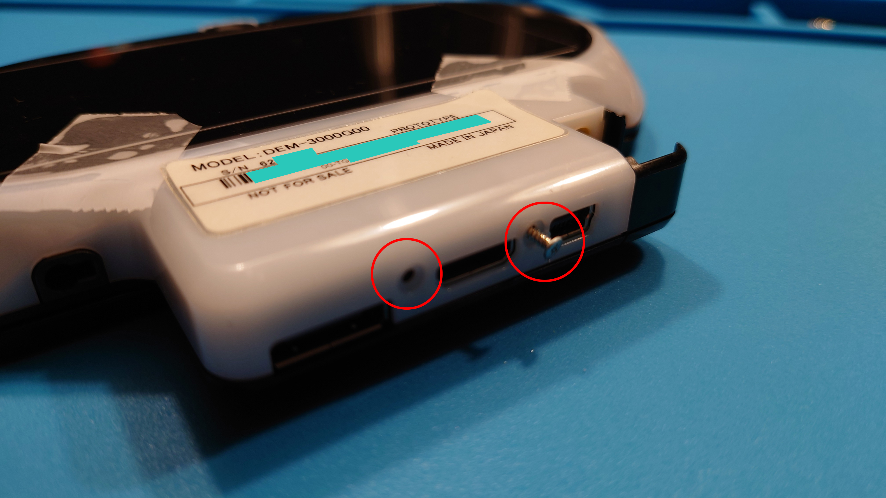
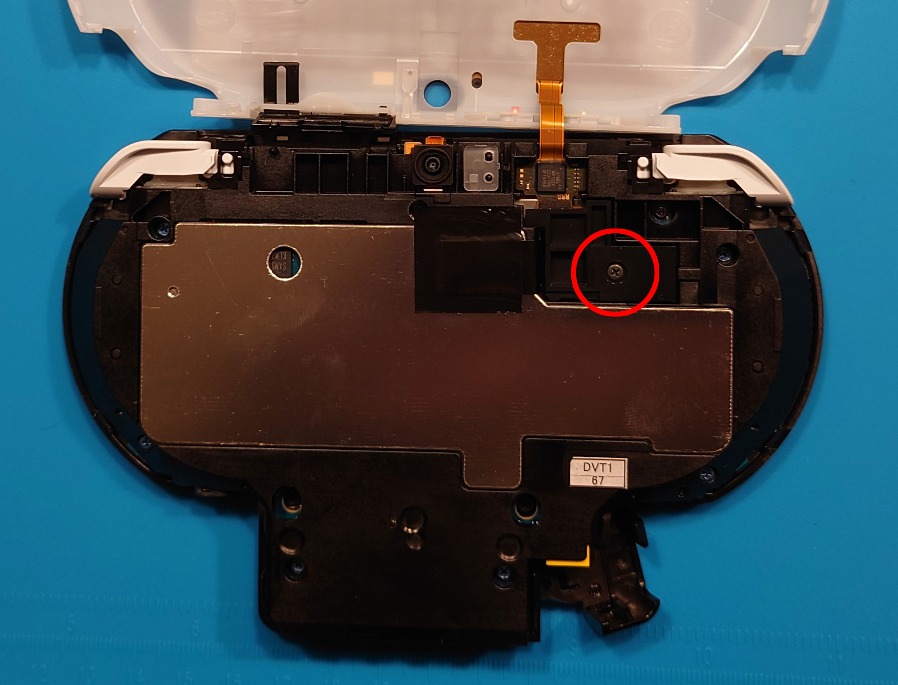

# The Sony DEM-3000G: A Teardown Guide

## Introduction 

Today we'll be taking a look at how to tear down the DEM-3000 PSP Go-style PS Vita prototype in detail. At the time of this guide's publication, this was the earliest-known DEM-3000 prototype to have surfaced. Given the extreme rarity of these devices in the wild, no such teardown guide existed, [with the exception of Yifan Lu's Twitch livestream](https://www.twitch.tv/videos/466913660?collection=VFOcz46nuhWTUw&filter=collections&sort=time). However, his teardown video is informal, incomplete, and his unit is missing several screws which can be confusing to know *what* needs to be removed and when.

This guide aims to provide a more comprehensive explanation of how to navigate the exterior and interior of the DEM-3000 prototype. The model shown in this guide is the DEM-3000G, but the same principles will apply to the DEM-3000H as there are no major differences with the physical appearance of the unit. 

## Supplies You'll Need

- TR10 screwdriver
- Craft knife to (carefully) remove the back label
- Wedge tool for removing the back cover
- CR2032 coin cell battery (if replacing)
- Scraper tool for lifting tape (optional)
- Parts tray to keep track of screws and pieces (optional)
- DEM-3000G/H (obviously)

## Let's Get Started

Begin with flipping the unit over to view the back side. There are four screws on the exterior we need to remove before opening the unit. We'll start with the first two that are hidden beneath the label:

The other two screws are on the bottom of the unit on the port hub, which we'll remove shortly. If you wish to preserve the back label, here's where you should use the craft knife. I recommend getting practice on various labels you have lying around, such as envelope labels or labels on electronics. The overall strategy you'll use is similar to this:

You should place the pointed tip of the knife on the VERY edge of the label, pull back to drop the knife to the level of the plastic, and *gently* push the craft knife in under the label. You will want to ***slowly*** drag the craft knife forward (the direction the blade edge faces) to separate the label from the adhesive.

It is possible to remove the screws without causing permanent damage to the label:

The corners can be smoothed out when you are ready to close the unit up, so the damage need not be permanent if you are careful. The corners look creased in this photo, but when you completely close the unit, the corners should be able to press down smoothly, leaving it virtually undetectable that the unit has been opened. I have placed some tape beneath the corners while working to prevent the corners from pressing down until I was ready to insert the screws again.

At the very bottom of the unit are the other two exterior screws you need to remove:

Once all four exterior screws are removed, take your wedge tool (in my case, the guitar pick from the iFixit kit) and get in between the black body and the white plastic back:

You are going to want to slide the tool around the sides of the unit like shown here:

**Caution**: Do not slide the pick at the top of the unit, as there is an internal flex cable connecting the back touch panel near the top. You do not want to accidentally sever or damage the flex cable.

As you slide the tool around, you are attempting to feel and free six tabs around the main body of the unit:

There are six tabs in total:

- Two on each side of the main body
- One on each side of the port hub

Once you get the back cover loose, you will want to remove the back cover like a clamshell, starting from the bottom like so:

This is what the unit should look like once you open it fully:

The back touch panel with its flex cable are a major hazard that we want to deal with as soon as possible. There is a black plastic bracket screwed in that covers the flex cable's connector. You need to remove this screw:

Once removed, carefully pull the black bracket covering out. You should see the flex cable connector:

Carefully use a tool like your wedge tool to pop the cable up from the connector:

You should now be able to remove the back cover completely and set it aside somewhere safe until we're ready to close the unit fully. This is what we should have thus far:

On the back of the exposed unit there are six blue screws and one washer screw to remove, as indicated below:

Once removed, you should be able to lift the back with the motherboard attached from the front face of the controller portion. **I recommend sliding the screen open for this next step, as it makes removal of the major internal flex cable easier**.

Below is the major internal flex cable you need to pop out carefully. You will open it in a clamshell fashion similar to how we removed the back touch panel:

It is easier to get your hands/tool in here to disconnect the cable if the unit is slid open with the screen out. Here's how the unit should look once you remove the flex cable:

We now need to carefully remove the camera flex cable here:

**Caution**: when you are reassembling the unit, make sure that this cable is pushed in as far as possible, as the unit may refuse to boot, stopping before the SceClockgen process which can lead to a lot of confusion as to what's *actually* wrong. There should only be about 1 mm of gold contacts poking out.

We need to remove the camera flex cable, because there is a hidden screw beneath it that we need to remove:

This screw is exceptionally easy to strip, so be ***very*** careful unscrewing it:

Flip the unit over to see the back again. There is a copper strip that is taped onto the metal shielding of the back. It is covered by black electrical tape:

You will need to remove the electrical tape to free the copper strip. You ***must*** remove the tape and free the copper strip to be able to remove the motherboard from the main body housing later. You can use your fingers or a scraper tool to peel the tape back:

Here's what you should see when the tape is removed:

Flip the unit back over to the face of the motherboard. There are six screws we need to remove, and two flex cables for the L and R buttons we need to unclasp:

After removing all the screws and freeing the L/R flex cables, you should be able to lift the motherboard out of the main housing. You can do so in a clamshell fashion again, where the first thing you should see is the CR2032 coin cell battery. 

This is what the motherboard front looks like when removed from the main body housing:

Likewise, here's what the motherboard back looks like:

Assuming your goal is to replace the CR2032 battery, you should be able to push the tabs on the battery holder to pop the battery out and replace it with a fresh one.

Congratulations! We've successfully disassembled the DEM-3000 PSP Go-style prototype!

## Conclusion

The number of people who this guide will help is ***very*** small, but the overall intention with this guide is to 
- Document full disassembly steps to get to the main motherboard,
- Make the disassembly process much less intimidating and blind
- Show the internals of what the DEM-3000 PSP Go-style prototype consist of.

It is important to note from the latter point that the photos shown in this guide are not an exhaustive collection. You can find the full, unedited photos of this unit [at the PS Dev Wiki](https://playstationdev.wiki/psvitadevwiki/DEM-3000G).

Thank you for reading, and let me know if this guide helped you preserve your own DEM-3000 prototype!

Sincerely with ❤️,

scalr
